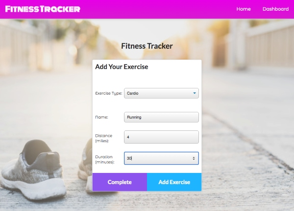

# Workout-Tracker

## Table of Contents
* [Description](#Description)
* [Installation](#Installation)
* [Usage](#Usage)
* [Demo](#Demo)
* [Contact](#Contact)

***
## Description

Built with Node, Express, MongoDB and Mongoose, this application allows users to track and view their daily workouts. 

Starter files were provided for the entire front-end code. Refer to the **starter-code** folder to view starter files.

**Deployed Link:** https://em-workout-tracker.herokuapp.com/

***
## Installation

If you are not utilizing the deployed version, follow the installation and usage instructions below.

Dependencies include: 
- Express
- Mongoose

To install necessary dependencies, run the following command:
```
npm i
```

***
## Usage

- After all dependencies are installed, run the following command:
```
npm start
```
- Open the app on your localhost:3000/

- Select "New Workout" or "Continue Workout". If you do not have any workouts saved in your database, you should select "New Workout". 

<p align="center">
  
</p>

- Select an exercise type and enter information in for the populated fields. 

- You can add multiple exercises in for one workout. If you have other exercises you plan to do, click "Add Exercise" after filling out the form. If you are finished your workout and do not plan to do any more exercises, click "Complete".

<p align="center">
  
</p>

- Click on the Dashboard in the navbar to view your weekly workout stats.

<p align="center">
  
</p>

***
## Demo
<p align="center">
  
</p>

***
## Contact
- **GitHub:**  https://github.com/jungjungie
- **Portfolio:**  https://jungjungie.github.io/